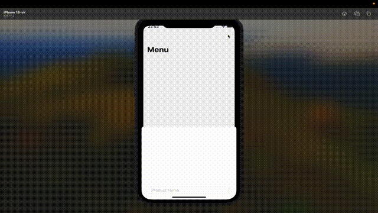
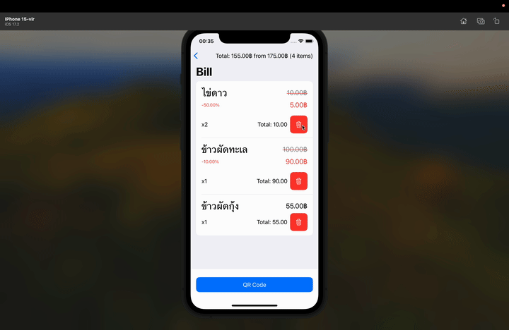
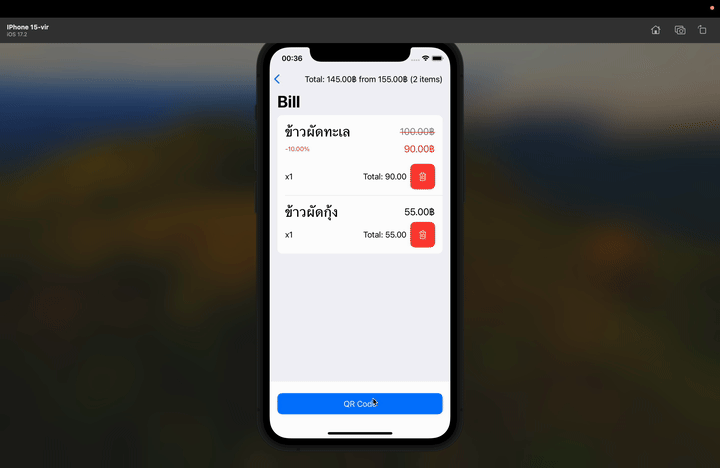

# API
- [https://promptpay.io](https://promptpay.io)

### How to use?

- `https://promptpay.io/<เบอร์โทรศัพท์>/<จำนวนเงิน>`
- `AsyncImage(url: URL(string: "https://promptpay.io/<0656549690>.png/\(bill.total_price)"))`

### GIF

Add product

Edit product

Discount product

Delete product

Add to cart

Delete order

View QR code

### Demonstratino video

Demo video[Demo](https://drive.google.com/file/d/1OC7IshDf3OlQ0ktUwx9fSjYMVGD3hLmD/view?usp=share_link)